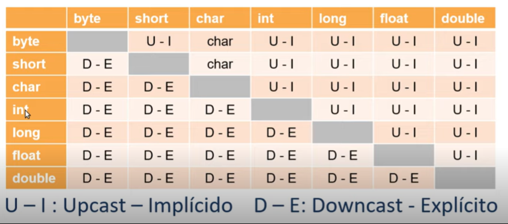

<h1>Conversões(Casting)</h1>

<h4>O que é casting?</h4>

`É a transformação de de uma determinada variável de tipo menos específico para um tipo mais específico e vice e versa`

<h4>Tipos de casting</h4>

<b>Upcast =></b> promoção (menor capacidade >> maior capacidade)

<b>Downcast =></b> rebaixa (maior capacidade >> menor capacidade) precisa explicitar

<H4>Como e quando utilizar</H4>

</img>

<b>Exemplo:</b>

`int i; long L = 100; i = (int) L;`

<i>No exemplo acima queremos transformar uma variável do tipo long para o tipo int. Se seguirmos a tabela, essa transformação seria um `downcasting` e precisa ser explicitada pela expressão `(int)`, a variável passa a utilizar menos espaço de armazenamento e fica sujeita a perda de informação.</i>

